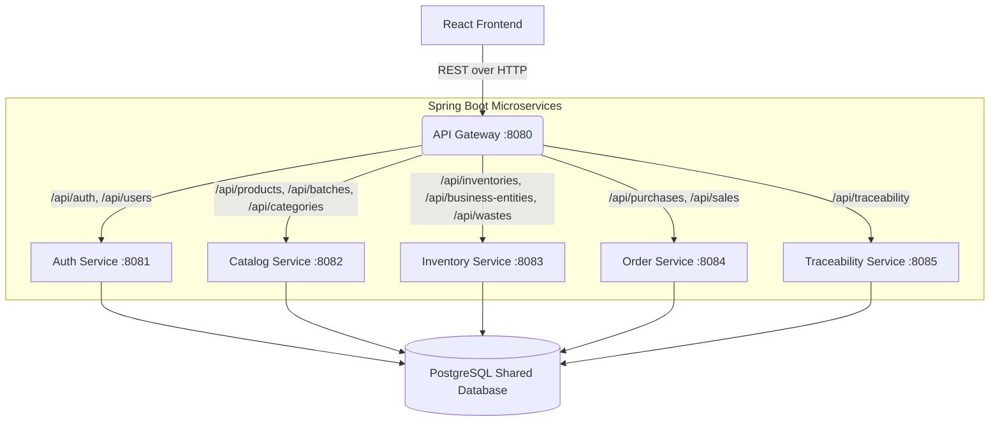
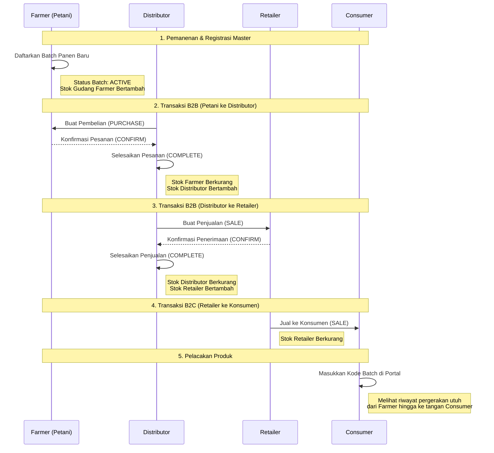
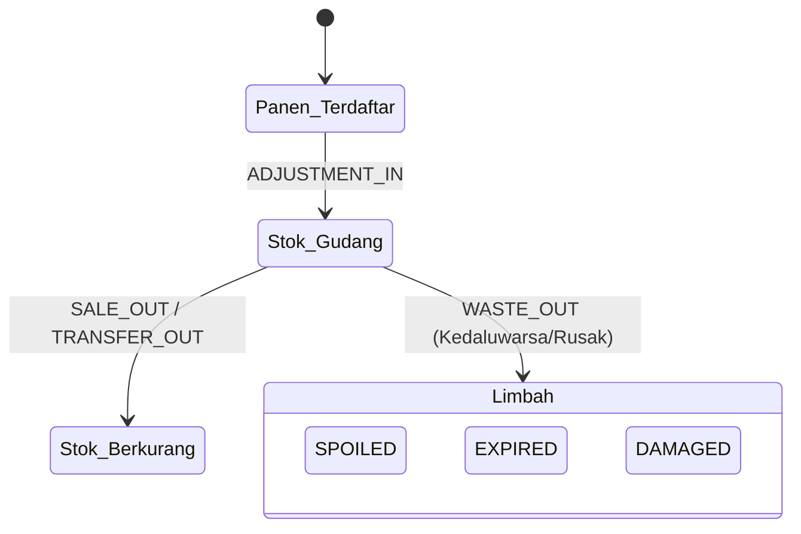

# CICLOVELA Flowcharts

## 1. Arsitektur Microservices (System Architecture)

```mermaid
graph TD
    Client[React Frontend] -->|REST over HTTP| Gateway(API Gateway :8080)
    
    subgraph Spring Boot Microservices
        Gateway -->|/api/auth, /api/users| Auth[Auth Service :8081]
        Gateway -->|/api/products, /api/batches, /api/categories| Catalog[Catalog Service :8082]
        Gateway -->|/api/inventories, /api/business-entities, /api/wastes| Inventory[Inventory Service :8083]
        Gateway -->|/api/purchases, /api/sales| Order[Order Service :8084]
        Gateway -->|/api/traceability| Trace[Traceability Service :8085]
    end

    Auth --> DB[(PostgreSQL Shared Database)]
    Catalog --> DB
    Inventory --> DB
    Order --> DB
    Trace --> DB
```

## 2. Alur Rantai Pasok (Supply Chain Flow)

```mermaid
sequenceDiagram
    participant F as Farmer (Petani)
    participant D as Distributor
    participant R as Retailer
    participant C as Consumer

    Note over F,C: 1. Pemanenan & Registrasi Master
    F->>F: Daftarkan Batch Panen Baru
    Note right of F: Status Batch: ACTIVE<br/>Stok Gudang Farmer Bertambah
    
    Note over F,C: 2. Transaksi B2B (Petani ke Distributor)
    D->>F: Buat Pembelian (PURCHASE)
    F-->>D: Konfirmasi Pesanan (CONFIRM)
    D->>D: Selesaikan Pesanan (COMPLETE)
    Note right of D: Stok Farmer Berkurang<br/>Stok Distributor Bertambah
    
    Note over F,C: 3. Transaksi B2B (Distributor ke Retailer)
    D->>R: Buat Penjualan (SALE)
    R-->>D: Konfirmasi Penerimaan (CONFIRM)
    D->>D: Selesaikan Penjualan (COMPLETE)
    Note right of D: Stok Distributor Berkurang<br/>Stok Retailer Bertambah
    
    Note over F,C: 4. Transaksi B2C (Retailer ke Konsumen)
    R->>C: Jual ke Konsumen (SALE)
    Note right of R: Stok Retailer Berkurang
    
    Note over F,C: 5. Pelacakan Produk
    C->>C: Masukkan Kode Batch di Portal
    Note right of C: Melihat riwayat pergerakan utuh<br/>dari Farmer hingga ke tangan Consumer
```

## 3. Alur Status Inventaris & Limbah

```mermaid
stateDiagram-v2
    [*] --> Panen_Terdaftar
    Panen_Terdaftar --> Stok_Gudang : ADJUSTMENT_IN
    Stok_Gudang --> Stok_Berkurang : SALE_OUT / TRANSFER_OUT
    Stok_Gudang --> Limbah : WASTE_OUT (Kedaluwarsa/Rusak)
    
    state Limbah {
        SPOILED
        EXPIRED
        DAMAGED
    }
```
